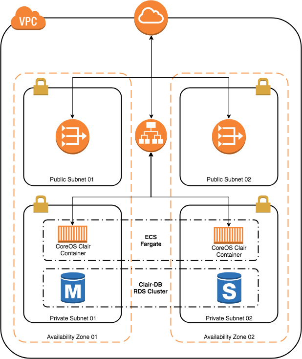

## AWS Codepipeline Docker Vulnerability Scan

CloudFormation template for deploying [CoreOS Clair](https://github.com/coreos/clair) and setting up [AWS CodePipeline](https://aws.amazon.com/codepipeline/) for automated vulnerability scanning of Docker Image pushed to Amazon [Elastic Container Registry (ECR)](https://aws.amazon.com/ecr/).


## Reference Architecture



## Prerequisites

- Docker
- Git
- AWS CLI installed. 
- AWS CLI is [configured](https://docs.aws.amazon.com/cli/latest/userguide/cli-chap-welcome.html) with IAM Access Key, Secret Access Key and Default region as US-EAST-1.

## VPC Requirement

A VPC in AWS-Region us-east-1 with:

- 2 Public Subnets
- 2 Private Subnets 
- NAT Gateways to allow internet access for services in Private Subnets. 

You can quickly create a VPC with above specification using the CloudFormation template "networking-template.yaml" included in the Github repository you cloned in the previous step.

```bash
cd aws-codepipeline-docker-vulnerability-scan

# Create VPC
aws cloudformation create-stack \
--stack-name coreos-clair-vpc-stack \
--template-body file://networking-template.yaml

# Get Stack Outputs
aws cloudformation describe-stacks \
--stack-name coreos-clair-vpc-stack \
--query 'Stacks[0].Outputs[*]'
```

## Clair Deployment

Clair uses PostgreSQL as the database. We will use Aurora-PostgreSQL Cluster to host the Clair database. We will deploy Clair as an ECS service using the Fargate launch type behind an AWS Application Load Balancer (ALB). The Clair container will be deployed in a Private Subnet behind an ALB that is hosted in the Public Subnets. The Private Subnets must have a route to the internet via the NAT Gateway as Clair will fetch the latest vulnerability information from multiple sources on the internet.

1. Build the CoreOS Clair Docker Image and push it to Elastic Container Registry (ECR).

```bash
# Create ECR Repository
aws ecr create-repository --repository-name coreos-clair

# Build the Docker Image
docker build -t <aws_account_id>.dkr.ecr.us-east-1.amazonaws.com/coreos-clair:latest ./coreos-clair

# Push the Docker Image to ECR
aws ecr get-login --no-include-email | bash
docker push <aws_account_id>.dkr.ecr.us-east-1.amazonaws.com/coreos-clair:latest
```

2. Deploy CoreOS Clair using CloudFormation Template.

```bash
# Create CloudFormation Stack
# <ECRRepositoryUri> - CoreOS Clair ECR Repository URI without Image tag
# Example - <aws_account_id>.dkr.ecr.us-east-1.amazonaws.com/coreos-clair

aws cloudformation create-stack \
--stack-name coreos-clair-stack \
--template-body file://coreos-clair/clair-template.yaml \
--capabilities CAPABILITY_IAM \
--parameters \
ParameterKey="VpcId",ParameterValue="<VpcId>" \
ParameterKey="PublicSubnets",ParameterValue=\"<PublicSubnet01-ID>,<PublicSubnet02-ID>\" \
ParameterKey="PrivateSubnets",ParameterValue=\"<PrivateSubnet01-ID>,<PrivateSubnet02-ID>\" \
ParameterKey="ECRRepositoryUri",ParameterValue="<ECRRepositoryUri>"
```

3. Note the output parameters of the above CloudFormation stack. These parameters are required for the subsequent commands.

```bash
# Get Stack Outputs
aws cloudformation describe-stacks \
--stack-name coreos-clair-stack \
--query 'Stacks[0].Outputs[*]'
```

## Deploying a sample website container

We will deploy a simple static website running on Nginx as a container on ECS Fargate. A CloudFormation Template is included in the sample code you cloned from GitHub.

### Create a CodeCommit Repository for Nginx Website

In this section we will create a CodeCommit Repository to host the sample Nginx Website code. Before you proceed with the below steps ensure [SSH authentication to CodeCommit](https://docs.aws.amazon.com/codecommit/latest/userguide/setting-up-ssh-unixes.html) is setup.

```bash
# Create CodeCommit Repository
# Note the cloneUrlSsh
aws codecommit create-repository --repository-name my-nginx-website

# Clone the Empty CodeCommit Repository
cd ../
git clone <cloneUrlSsh>

# Copy the contents of nginx-website to my-nginx-website
cp -R aws-codepipeline-docker-vulnerability-scan/nginx-website/ my-nginx-website/

# Commit the changes
cd my-nginx-website/
git add *
git commit -m "Initial commit"
git push
```

### Build Nginx Docker Image

1. Build the Nginx website Docker Image and push it to Elastic Container Registry (ECR).

```bash
# Create ECR Repository
# Note the URI and ARN of the ECR Repostiory
aws ecr create-repository --repository-name nginx-website

# Build the Docker Image
cd ../nginx-website
docker build -f Dockerfile-amznlinux -t <aws_account_id>.dkr.ecr.us-east-1.amazonaws.com/nginx-website:latest ./

# Push the Docker Image to ECR
docker push <aws_account_id>.dkr.ecr.us-east-1.amazonaws.com/nginx-website:latest
```

2. Let us now deploy the Nginx-website as an ECS service using the Fargate launch type. The Stack below deploys the Nginx-Website onto same ECS cluster (clair-demo-cluster) as CoreOS Clair.

```bash
# Create CloudFormation Stack
# <ECRRepositoryUri> - Nginx-Website ECR Repository URI without Image tag
# <aws_account_id>.dkr.ecr.us-east-1.amazonaws.com/nginx-website

cd ../aws-codepipeline-docker-vulnerability-scan/

aws cloudformation create-stack \
--stack-name nginx-website-stack \
--template-body file://nginx-website/nginx-website-template.yaml \
--capabilities CAPABILITY_IAM \
--parameters \
ParameterKey="VpcId",ParameterValue="<VpcId>" \
ParameterKey="PublicSubnets",ParameterValue=\"<PublicSubnet01-ID>,<PublicSubnet02-ID>\" \
ParameterKey="PrivateSubnets",ParameterValue=\"<PrivateSubnet01-ID>,<PrivateSubnet02-ID>\" \
ParameterKey="ECRRepositoryUri",ParameterValue="<ECRRepositoryUri>"
```

3. Note the output parameters of the above CloudFormation stack. These parameters are required for the subsequent commands.

```bash
# Get Stack Outputs
aws cloudformation describe-stacks \
--stack-name nginx-website-stack \
--query 'Stacks[0].Outputs[*]'
```

## AWS CodePipeline

In this section we will build a CodePipeline to automate the vulnerability scanning of future Nginx-Website docker image builds.
The **nginx-website** folder includes a **buildspec.yml** file that provides build instructions to CodeBuild.

We will be using [Klar](https://github.com/optiopay/klar), a simple tool to analyse images stored in a private or public Docker registry for security vulnerabilities using CoreOS Clair. Klar serves as a client which coordinates the image checks between the ECR and Clair.

The buildspec.yml we have set the *CLAIR_OUTPUT=Critical*. CLAIR_OUTPUT variable defines the severity level threshold, vulnerabilities with severity level higher than or equal to this threshold will be outputted. Supported levels are **Unknown, Negligible, Low, Medium, High, Critical, Defcon1**.
You can configure Klar to your requirements by setting the variables as defined in the [Klar documentation](https://github.com/optiopay/klar).

1. Deploy the CodePipeline using CloudFormation Template.

```bash
# Deploy CodePipeline
# Replace the Variables below
# WebsiteECRRepositoryARN – Nginx Website ECR Repository ARN
# WebsiteECRRepositoryURI – Nginx Website ECR Repository URI
# ClairAlbDnsName - Output variable from coreos-clair-stack
# EcsServiceName – Output variable from nginx-website-stack

aws cloudformation create-stack \
--stack-name nginx-website-codepipeline-stack \
--template-body file://clair-codepipeline-template.yaml \
--capabilities CAPABILITY_IAM \
--disable-rollback \
--parameters \
ParameterKey="EcrRepositoryArn",ParameterValue="<WebsiteECRRepositoryARN>" \
ParameterKey="EcrRepositoryUri",ParameterValue="<WebsiteECRRepositoryURI>" \
ParameterKey="ClairAlbDnsName",ParameterValue="<ClairAlbDnsName>" \
ParameterKey="EcsServiceName",ParameterValue="<WebsiteECSServiceName>"
```

The CodePipeline will be triggered once the CloudFormation stack creation is complete. You can log in to your AWS console to monitor the status of the CodePipeline. The vulnerability scan information is available in the CodeBuild CloudWatch Logs.

You can also modify the CLAIR_OUTPUT from Critical to High in the buildspec.yml in the cores-clair-ecs-cicd/nginx-website-repo folder and check the status of the build.

The CoreOS Clair we deployed can used as a centralized Docker Image vulnerability scanner and used by other CodeBuild projects.

## License Summary

This sample code is made available under a modified MIT license. See the LICENSE file.
